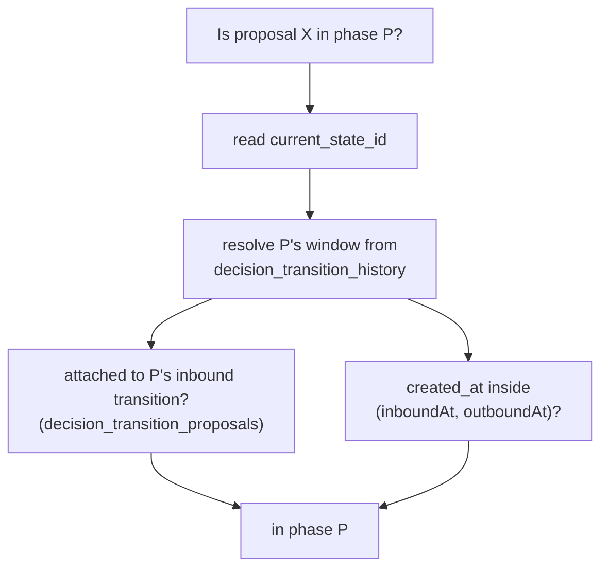
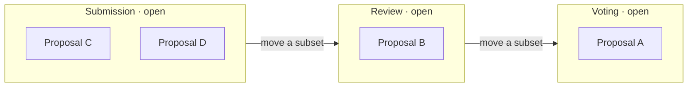
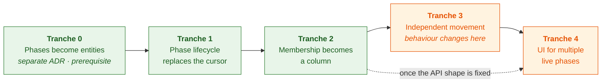

# 2. Proposals hold their own phase, and phases become entities

Date: 2026-08-27

## Status

Proposed

## Context

A decision instance has one cursor, `decision_process_instances.current_state_id`.
Phase membership is never stored, only recomputed from it:

That is `getProposalsForPhase.ts`, including the SQL-pushdown hot path
`getPhaseProposalSqlScope`. The same cursor gates submitting, voting and
reviewing via `instanceData.phases[current].rules`, and `advancePhase` flips it
under an optimistic lock before `onPhaseAdvanced` generates review assignments
and processes results.

We need proposals to move independently:

This breaks the derivation, not just the cursor. Without an instance-level
outbound transition there is no window to close. It also breaks a conflation the
cursor hides: `rules.proposals.submit` ("is intake open?") is a property of the
**phase**, while `rules.reviews.submit` and `rules.voting.submit` ("may I act on
this proposal?") are properties of **where a proposal sits**.

A second problem surfaced. A phase has no database identity. `phaseId` is a
`varchar(256)` denormalized across `proposal_review_assignments`,
`decision_proposal_reviews`, `category_reviewers`,
`decision_transition_history.{from,to}_state_id`,
`decision_process_transitions.{from,to}_state_id` and `current_state_id`, with no
foreign key anywhere. It is defined in a JSON array, and phase order is array
position — so editing that array dangles those rows, and reordering it inverts
every `isPhaseAtOrBefore` and `hasPhaseEnded` gate.

So: two entangled axes — phase identity, and where membership lives.

Scope is `@op/common`'s decision services, the `decision_*` tables, the tRPC
decision routers and the decision UI. `current_state_id` is read in ~220 places.
Legacy instances (`isLegacyInstanceData`) bypass phase scoping and stay out.

### Axis 1: should phases be entities?

In this codebase an entity _is_ a profile — `EntityType` is the `type` column on
`profiles`, and the pattern is a domain table plus a profile FK
(`decision_proposals`, `process_instances`, `organizations`, `individuals`).

Authorization decides it. Permissions are profile-scoped throughout
(`access_roles.profile_id`, `access_role_permissions_on_access_zones.profile_id`,
`profile_users.profile_id`), so per-phase authorization has been hand-rolled
three times: `category_reviewers.phase_id`, `proposal_review_assignments`' unique
`(instance, proposal, reviewer_profile, phase_id)`, and
`reviewHelpers.canReadPhaseReviews`. Meanwhile `getEligibleReviewerProfileIds`
already resolves reviewers profile-natively — but only at the decision level.
Three bespoke mechanisms exist because a phase cannot hold a role grant.

Give a phase a profile and its reviewers become `profile_users` with a review
role, one level below the decision profile, resolved by the same query.

Costs: a profile and unique slug per phase per instance (proposals already do
this at higher cardinality); `EntityType.PHASE` needs permission defaults
alongside the existing `[EntityType.DECISION]` mappings; and the collapse is
partial, since `category_reviewers` also carries `taxonomy_term_id`.

Templates keep no profile. `decision_processes.process_schema` is a document;
only instantiation mints entities.

### Axis 2: membership as a column, or as a join table

**B — column.** `decision_proposals.phase_id` plus `phase_entered_at`.
Membership is `WHERE phase_id = $1`. History lives in an append-only
`decision_proposal_phase_transitions`.

**C — join table.** `decision_proposal_phases (…, entered_at, exited_at)`.
Membership is `exited_at IS NULL`; its history _is_ its state, so there is one
structure instead of two. A partial unique index on `(proposal_id) WHERE
exited_at IS NULL` gives B's semantics today, and dropping it is the whole
migration to parallel tracks.

The hot path decides it. `listProposals` keyset-paginates on
`proposals.{created_at | updated_at | status}` with an `id` tiebreak and composes
the phase filter into the same query. Under B the existing
`(process_instance_id, created_at, id)` index gains `phase_id` and one scan still
serves filter and ordering. Under C the filter and sort keys sit in different
tables, which no single index serves; the escapes are denormalizing `created_at`
into the membership row, or paginating by `entered_at` and changing the product's
sort order to settle a schema question. That is a permanent cost against a
requirement we do not yet have.

Rejected: a nullable `phase_id` override falling back to the derived window. Two
membership mechanisms that disagree at the edges, and the fallback never becomes
deletable.

## Decision

Phases become entities — a table plus a profile. Membership goes on the proposal.
The entity work is a prerequisite delivered separately; see **Delivery order**.

1. Add `decision_phases (id, process_instance_id, profile_id, phase_id, position,
name, rules, selection_pipeline, settings, rubric_template, start_date,
end_date, state)`, unique on `(process_instance_id, phase_id)`. `phase_id`
   stays the human-readable instance-scoped key, `id` is the FK target,
   `position` replaces array index, and `state`
   (`not_started | open | closed`) replaces `current_state_id` for gating intake.
2. Add `EntityType.PHASE` and mint a profile per phase. Move reviewer rosters
   onto phase-profile membership; `category_reviewers` keeps `taxonomy_term_id`
   and loses `phase_id`. Migrate the six `varchar` references to foreign keys.
3. Add `decision_proposals.phase_id` (FK) and `phase_entered_at`, indexed on
   `(process_instance_id, phase_id, created_at, id)` to keep one-index keyset
   pagination.
4. Add `decision_proposal_phase_transitions`, carrying `proposal_history_id` and
   `batch_id`, superseding `decision_transition_proposals`. `phase_id` is a
   projection of this log and must stay derivable from it.
5. Rewrite `getProposalsForPhase.ts` against `phase_id`. Backfill non-legacy
   instances with today's derivation, then delete the window resolver. Legacy
   instances keep `phase_id NULL`.
6. Recast the instance advance as a batch move over a phase's cohort. The
   selection pipeline still runs; side effects fire per batch.
7. Make results processing an explicit instance close, since proposals now reach
   the last phase continuously.

C is not adopted. If parallel tracks become a requirement,
`decision_proposal_phase_transitions` holds the history and `decision_phases` is
the FK target, so C is reachable without a second backfill.

### Delivery order

Phases-as-entities is a prerequisite, not a step: a separate decision about the
identity model, touching tables this change does not. It warrants its own ADR
covering `EntityType.PHASE` permission defaults and phase profile lifecycle.

0. **Phases become entities.** Add the table, `EntityType.PHASE` and a profile
   per phase, dual-written at instantiation and backfilled from
   `instanceData.phases[]`. Migrate the six references to FKs and move reviewer
   rosters. Reads still use `instanceData.phases[]`; `current_state_id` untouched.
1. **Phase lifecycle replaces the cursor.** Add `state`, backfilled from cursor
   position. Triage the ~220 reads into instance-scoped (read `state`) and
   proposal-scoped (still derived). Assert exactly one `open` phase per instance.
2. **Membership becomes a column.** Add `phase_id`, `phase_entered_at` and the
   transitions table. Backfill with today's derivation, shadow-read both and log
   divergence, then cut over and delete the window resolver.
3. **Independent movement.** Drop the one-open-phase invariant. Add the batch
   move, per-batch side effects, results as explicit close, and per-phase
   scheduled deadlines.
4. **UI for multiple live phases.** Needs its own design pass; can start
   alongside tranche 3 once the API shape is fixed.

Tranches 0–2 are behaviour-preserving and independently revertable. Every
migration and backfill bakes in production before anything user-visible changes.

## Consequences

Phase-scoped reads collapse to a `WHERE` clause, so the ID-materialization and
SQL-pushdown machinery in `getProposalsForPhase.ts` goes away and phase-scoped
lists sort and paginate in the database.

Independent movement becomes expressible, and a phase can be `open` for
submissions while proposals leave it one at a time.

Phases gain referential integrity, explicit ordering, and per-phase membership
and role grants in the standard access-zones vocabulary — replacing three
hand-rolled mechanisms.

Phase configuration moves out of `instance_data` into a table, and instantiation
mints profiles. `createInstanceFromTemplate`, `duplicateInstance`,
`updateTransitionsForProcess`, `translateDecision` and the API encoders exposing
`instanceData.phases` all change; the encoder change is client-visible. Editing
or reordering phases in the Process Builder becomes a row operation with live
FKs, so it needs guard rails.

Phase state is written rather than derived, so a bug corrupts data instead of
producing a wrong answer that a fix would correct on the next read. Keeping
`phase_id` derivable from the transition log preserves a rebuild path, but the
reconciler has to be written. `advancePhase`'s single-row optimistic lock becomes
a batch write, and concurrent moves over overlapping sets need conflict handling.

Backfill touches every non-legacy instance, and the ~220 `current_state_id` reads
each need a judgement about whether they ask about a proposal or the instance — a
distinction the code does not currently draw.

The UI loses its single answer to "what phase is this decision in".
`DecisionStateRouter` routes the whole decision off the current phase and
`DecisionProcessStepper` renders one active step; both need a model where several
phases are live. That is a design question, not a refactor, and the largest piece
of work this creates.

Scheduled transitions (`decision_process_transitions.scheduled_date`) become
per-phase deadlines rather than instance-wide clock ticks.
