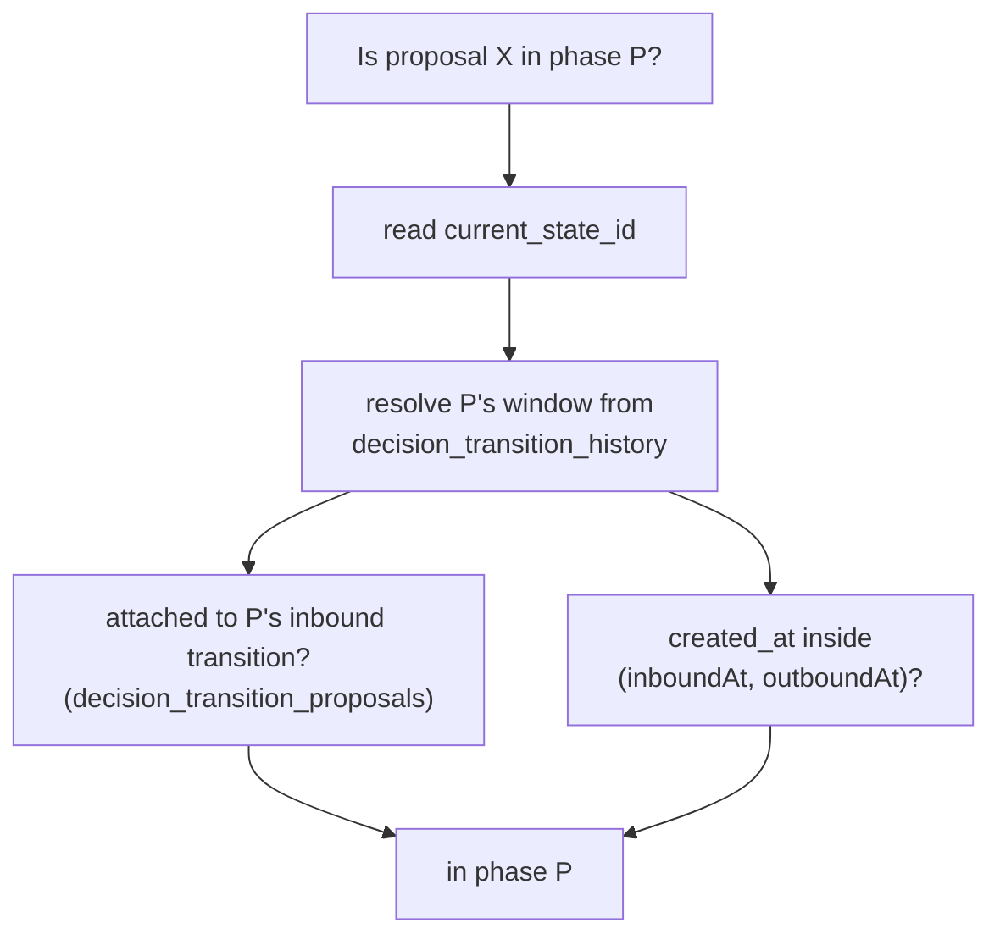
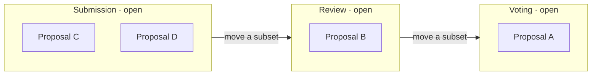
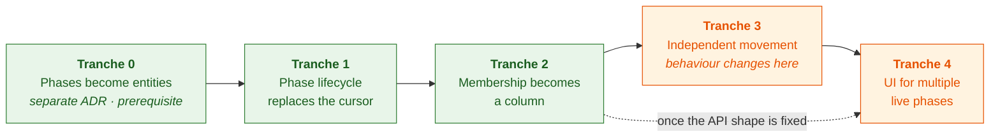

# 2. Proposals hold their own phase, and phases become entities

Date: 2026-08-27

## Status

Proposed

## Context

A decision instance has exactly one cursor:
`decision_process_instances.current_state_id`. Everything about phases derives
from it plus an append-only log:

- **Gating** — `instanceData.phases[current].rules` decides whether anyone may
  submit, vote, or review (`voting.ts`, `reviewHelpers.ts`, `permissions.ts`).
- **Membership** — a proposal is "in phase P" iff it was attached to P's inbound
  transition (`decision_transition_proposals`) or its `createdAt` falls inside
  P's temporal window `(inboundAt, outboundAt)`, resolved from
  `decision_transition_history`. That is the whole of `getProposalsForPhase.ts`,
  including the SQL-pushdown hot path `getPhaseProposalSqlScope`.
- **Side effects** — `advancePhase` flips the cursor under an optimistic lock,
  runs the departing phase's selection pipeline over the entire cohort, and
  `onPhaseAdvanced` generates review assignments and, on the last phase,
  processes results.

Membership is therefore never stored, only recomputed:

We now need proposals to move independently. Submission stays open and keeps
accepting proposals while proposal A moves to review and then to voting, and
proposal B is still in submission. Several phases are live at once, and the
phase becomes a property of the proposal rather than of the process.

That breaks the derivation, not just the cursor. With no instance-level outbound
transition there is no window to close, so `createdAt`-window membership stops
answering the question. It also breaks a conflation the single cursor has been
hiding: `rules.proposals.submit` ("is intake open?") is a property of the
**phase**, while `rules.reviews.submit` and `rules.voting.submit` ("may I act on
this proposal?") are properties of **where a proposal sits**. One cursor answers
both; nothing else can.

Working through it surfaced a second, independent problem. A phase has no
identity in the database. `phaseId` is a bare `varchar(256)` denormalized across
`proposal_review_assignments`, `decision_proposal_reviews`, `category_reviewers`,
`decision_transition_history.{from,to}_state_id`,
`decision_process_transitions.{from,to}_state_id`, and `current_state_id`, with
**no foreign key anywhere**. Its definition lives in a JSON array on
`instance_data`, and phase _order is array position_ — so editing that array can
silently dangle every one of those rows, and reordering it changes the meaning of
every `isPhaseAtOrBefore` and `hasPhaseEnded` gate. Today one cursor and one
ordered array keeps this just about coherent. Per-proposal movement removes that
cover.

So there are two axes, and they are not independent:

1. **Phase identity** — phases stay JSON config, or become entities.
2. **Membership** — where "proposal X is in phase P" lives.

Scope: `@op/common`'s decision services, the `decision_*` tables, the tRPC
decision routers, and the decision UI. `current_state_id` is read in ~220 places
across those four areas. Legacy instances (`isLegacyInstanceData`) bypass phase
scoping and stay out of scope.

### Axis 1: should phases be entities?

In this codebase an entity _is_ a profile. `EntityType` is the `type` column on
`profiles` (`org | individual | proposal | decision`), and the established
pattern is a domain table plus a profile FK: `decision_proposals.profile_id`,
`process_instances.profile_id`, `organizations.profile_id`,
`individuals.profile_id`. There is no third kind of thing, so "should phases be
first-class entities" and "should phases have profiles" are one question.

The answer is yes, and authorization decides it. Permissions here are
profile-scoped all the way down — `access_roles.profile_id`,
`access_role_permissions_on_access_zones.profile_id`, `profile_users.profile_id`.
Nothing can be scoped to something that is not a profile.

Per-phase authorization is nonetheless a live requirement, so it has been
hand-rolled around that gap three times over. `getEligibleReviewerProfileIds`
resolves reviewers profile-natively but only at the decision level —
`profile_users` on the decision's profile joined to access roles carrying review
permission — and everything phase-shaped is bolted on beside it:
`category_reviewers` carries a nullable `phase_id` ("NULL = instance-wide; set =
phase-specific"), `proposal_review_assignments` is unique on `(instance,
proposal, reviewer_profile, phase_id)`, and `reviewHelpers.canReadPhaseReviews`
re-derives phase read access from `access.review` plus `openReviews` plus
`isPhaseAtOrBefore`. Three bespoke mechanisms exist because a phase cannot hold
a role grant.

A phase profile closes that with the mechanism we already have: a phase's
reviewers become `profile_users` on the phase profile with a review role, one
level below the decision profile, resolved by the same query. The change we are
making pushes the same way — once proposals move independently a phase stops
being a cursor value and becomes a place, with its own occupants, dates, rules
and page.

The costs are real but not disqualifying. Every instance mints a profile per
phase, each needing a globally unique slug — but proposals already do this at
higher cardinality and at user-facing rates, so the pattern is proven, and a
profile does not imply a top-level URL (a proposal's page is nested under its
decision). `EntityType.PHASE` needs permission defaults alongside the existing
`[EntityType.DECISION]: { decisions: permission.ADMIN }` mappings, which is a
design decision rather than an enum edit. And the collapse is partial:
`category_reviewers` also carries `taxonomy_term_id`, so category-scoped
reviewing becomes phase-profile membership _times_ a category scope, not a
deletion.

Templates stay as they are. `decision_processes.process_schema` has no profile
and should not get one — a template is a document, and only instantiation mints
entities.

### Axis 2: membership as a column, or as a join table

**B — column on the proposal.** `decision_proposals.phase_id` (FK to
`decision_phases`) plus `phase_entered_at`. Current membership is `WHERE phase_id
= $1`. History goes in an append-only `decision_proposal_phase_transitions`
table carrying `proposal_history_id` (preserving the snapshot semantics of
`decision_transition_proposals`) and a `batch_id` so a bulk move reads back as
one operation.

**C — join table.** `decision_proposal_phases (process_instance_id, proposal_id,
phase_id, entered_at, exited_at)`. Current membership is `exited_at IS NULL`;
history is every row. A partial unique index on `(proposal_id) WHERE exited_at IS
NULL` enforces one phase per proposal today, and _dropping that index_ is the
entire migration to parallel tracks — a proposal under legal and budget review at
once, or in review while still open for community comment.

C is the more honest model and it unifies two structures into one: B has a
current-state column and a history table that must agree, where C's history _is_
its state. That is a real argument, and the multi-membership objection is weaker
than it looks, because the constraint makes C behave exactly like B until we
choose otherwise.

The hot read path decides it. `listProposals` keyset-paginates on
`proposals.{created_at | updated_at | status}` with an `id` tiebreak, and
composes the phase filter into that same query. Under B the filter column sits on
`proposals`, so the existing `(process_instance_id, created_at, id)` index simply
gains `phase_id` and one index scan still satisfies filter and ordering together.
Under C the filter lives in one table and the sort keys in another, which no
single index can serve; the fixes are to denormalize `created_at` into the
membership row (reintroducing the two-sources-of-truth problem C was meant to
avoid) or to paginate by `entered_at` instead, changing the product's sort order
to settle a schema question. This is the case our CLAUDE.md sorting rule exists
to protect, and it is a permanent everyday cost, where parallel tracks are a
requirement we do not have yet.

A third option — a nullable `phase_id` override falling back to the derived
window — was rejected: it keeps two membership mechanisms that disagree at the
edges, and the fallback becomes undeletable.

## Decision

We will make phases first-class entities — a table plus a profile, following the
pattern `proposals` and `process_instances` already use — and put membership on
the proposal. The entity work is a prerequisite delivered separately; see
**Delivery order** below.

1. Add `decision_phases (id, process_instance_id, profile_id, phase_id, position,
name, rules, selection_pipeline, settings, rubric_template, start_date,
end_date, state)`, unique on `(process_instance_id, phase_id)`. `phase_id`
   stays the human-readable instance-scoped key; `id` is the FK target.
   `position` replaces array index as the ordering. `state` is `not_started |
open | closed` and replaces `current_state_id` as the thing that gates intake.
2. Add `EntityType.PHASE` and mint a profile per phase at instantiation, so a
   phase can hold `profile_users` and role grants. Move per-phase reviewer
   rosters onto phase-profile membership; `category_reviewers` keeps its
   `taxonomy_term_id` scope and loses its hand-rolled `phase_id`. Migrate the six
   `varchar` phase references to real foreign keys.
3. Add `decision_proposals.phase_id` (FK) and `phase_entered_at`, with an index
   on `(process_instance_id, phase_id, created_at, id)` so the list path keeps
   one-index keyset pagination.
4. Add `decision_proposal_phase_transitions` as the sole history of movement,
   carrying `proposal_history_id` and `batch_id`. It supersedes
   `decision_transition_proposals`. `decision_proposals.phase_id` is a projection
   of this log and must always be derivable from it, so a reconciler can rebuild
   it.
5. Rewrite `getProposalsForPhase.ts` against `phase_id`. Backfill non-legacy
   instances by running today's derivation once per phase, then delete the window
   resolver. Legacy instances keep `phase_id NULL` and the existing unscoped path.
6. Recast the instance-level advance as a batch move over a phase's cohort. The
   selection pipeline still runs; `onPhaseAdvanced`'s side effects fire per batch
   rather than per cursor flip.
7. Make results processing an explicit instance-level close action. It stops
   being triggered by "the cursor reached the last phase", because proposals now
   reach the last phase continuously.

We do not adopt C now. If parallel tracks become a requirement,
`decision_proposal_phase_transitions` already holds the history a membership
table needs and `decision_phases` is already the FK target, so C is reachable
without a second backfill.

### Delivery order

Making phases entities is a prerequisite, not a step. It is a separate decision
about the platform's identity model, it touches tables this change does not, and
it is worth its own ADR covering `EntityType.PHASE` permission defaults and phase
profile lifecycle. Nothing here starts until it has landed.

**Tranche 0 — phases become entities.** Add `decision_phases`,
`EntityType.PHASE`, and a profile per phase, dual-written at instantiation and
backfilled from `instanceData.phases[]`. Migrate the six `varchar` references to
foreign keys and move reviewer rosters onto phase-profile membership. Reads still
go through `instanceData.phases[]` and `current_state_id` is untouched.

**Tranche 1 — phase lifecycle replaces the cursor.** Add `decision_phases.state`
and backfill it from cursor position: phases before it `closed`, the cursor
`open`, the rest `not_started`. Triage the ~220 `current_state_id` reads into
instance-scoped (read phase `state`) and proposal-scoped (still derived). Assert
the invariant that exactly one phase is `open` per instance.

**Tranche 2 — membership becomes a column.** Add `decision_proposals.phase_id`,
`phase_entered_at`, and `decision_proposal_phase_transitions`. Backfill by
running today's derivation once per phase. Shadow-read both mechanisms and log
divergence before cutting `getProposalsForPhase` over and deleting the window
resolver.

**Tranche 3 — independent movement.** Drop the one-open-phase invariant. Add the
batch move, fire side effects per batch, make results an explicit instance close,
and turn scheduled transitions into per-phase deadlines. This is where behaviour
changes.

**Tranche 4 — UI for multiple live phases.** Needs its own design pass; can start
alongside tranche 3 once the API shape is fixed.

Tranches 0 through 2 are all behaviour-preserving. Every migration and backfill
lands and bakes in production before anything a user can see changes, and each is
revertable on its own. Only tranche 3 flips behaviour, and by then the data it
depends on has already been correct in production for a while. That is the point
of the order.

## Consequences

Phase membership becomes a column, so every phase-scoped read collapses to a
`WHERE` clause and the ID-materialization and SQL-pushdown machinery in
`getProposalsForPhase.ts` goes away. Phase-scoped lists sort and paginate in the
database, which the current derived-set approach makes awkward.

Independent movement becomes expressible, and the intake/action distinction the
cursor was hiding becomes explicit: a phase can be `open` for submissions while
proposals leave it one at a time.

Phases gain referential integrity and an explicit order, so renaming or
reordering a phase stops silently dangling review assignments and inverting
`isPhaseAtOrBefore` gates. As entities they also gain the thing three hand-rolled
mechanisms were substituting for: per-phase membership and role grants expressed
in the standard access-zones vocabulary, which is where per-phase reviewer
rosters and phase-scoped read access should have lived all along.

The cost is that phase configuration moves out of `instance_data` into a table
and instantiation now mints profiles: `createInstanceFromTemplate`,
`duplicateInstance`, `updateTransitionsForProcess`, `translateDecision`, and the
API encoders that expose `instanceData.phases` all change, and the encoder change
is visible to clients. Deleting or reordering phases in the Process Builder
becomes a row operation with live FKs rather than a JSON edit, so it needs its
own guard rails. Slug generation runs per phase per instance, and
`EntityType.PHASE` has to be given a permission mapping before anything can be
granted on it.

Phase state is now written rather than derived, so a bug corrupts data instead of
producing a wrong answer a fix would correct on the next read. Requiring
`phase_id` to be derivable from the transition log keeps a rebuild path, but
somebody has to write the reconciler. `advancePhase`'s single-row optimistic lock
becomes a batch write, and concurrent moves over overlapping proposal sets need
their own conflict handling.

The migration is not incremental. Backfill touches every non-legacy instance, and
the ~220 `current_state_id` reads must be triaged into "asks about a proposal"
(reads `phase_id`) and "asks about the instance" (reads phase `state`) — a
distinction the code does not currently draw, so each call site needs a judgement.

The UI loses its single answer to "what phase is this decision in".
`DecisionStateRouter` routes the whole decision off the current phase and
`DecisionProcessStepper` renders one active step; both need a model where several
phases are live and each proposal carries its own position. That is a design
question, not a refactor, and it is the largest piece of work this decision
creates.

Scheduled transitions (`decision_process_transitions.scheduled_date`) become
per-phase deadlines — "close this phase and move what remains" — rather than
instance-wide clock ticks.
