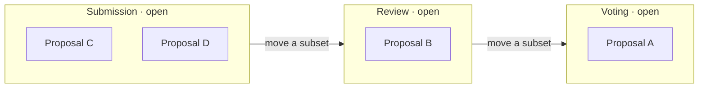
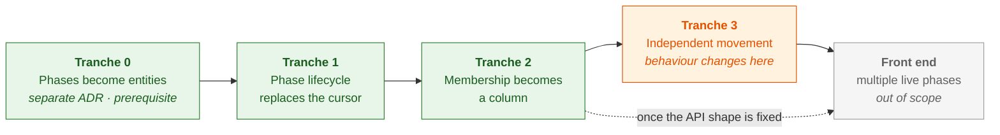

# 2. Proposals hold their own phase, and phases become entities

Date: 2026-08-27

## Status

Proposed

## Context

A decision instance has one cursor, `decision_process_instances.current_state_id`.
Phase membership is never stored, only recomputed from it:

```mermaid
flowchart TD
    Q["Is proposal X in phase P?"] --> CUR["read current_state_id"]
    CUR --> WIN["resolve P's window from<br/>decision_transition_history"]
    WIN --> A["attached to P's inbound transition?<br/>(decision_transition_proposals)"]
    WIN --> B["created_at inside<br/>(inboundAt, outboundAt)?"]
    A --> YES["in phase P"]
    B --> YES
```

That is `getProposalsForPhase.ts`, including the SQL-pushdown hot path
`getPhaseProposalSqlScope`. The same cursor gates submitting, voting and
reviewing via `instanceData.phases[current].rules`, and `advancePhase` flips it
under an optimistic lock before `onPhaseAdvanced` generates review assignments
and processes results.

We need proposals to move independently:

This breaks the derivation, not just the cursor. Without an instance-level
outbound transition there is no window to close.

### Resolving a user's phase

The cursor is also how the product answers "what can this user do right now", so
it has to be replaced rather than removed. Three questions hide behind one read:

| Question                                 | Scoped to    | Resolved by                                 |
| ---------------------------------------- | ------------ | ------------------------------------------- |
| May I submit a proposal?                 | the instance | an open phase with `rules.proposals.submit` |
| May I review or vote on _this_ proposal? | the proposal | that proposal's phase, and its window       |
| What am I looking at?                    | the view     | an explicit phase in the route              |

The first two are back-end questions and are decided here; the third is a
front-end question and is not.

Each check gets simpler. `isReviewPhase(phase)` and `isVotingPhase(phase)`
already take a phase rather than a cursor, so review and vote become a lookup on
`proposal.phase_id` with none of the array-position arithmetic in
`isPhaseAtOrBefore` or `hasPhaseEnded`. The difficulty moves into _selecting_ the
phase, and only bites when two of the same kind are open at once: with two open
intake phases a `createProposal` call has no unique target.

### Phases have no identity

`phaseId` is a `varchar(256)` denormalized across `proposal_review_assignments`,
`decision_proposal_reviews`, `category_reviewers`,
`decision_transition_history.{from,to}_state_id`,
`decision_process_transitions.{from,to}_state_id` and `current_state_id`, with no
foreign key anywhere. It is defined in a JSON array, and phase order is array
position — so editing that array dangles those rows, and reordering it inverts
every `isPhaseAtOrBefore` and `hasPhaseEnded` gate.

So: three entangled axes — phase identity, where membership lives, and whether
phases may be open at the same time.

This ADR decides the **back end**: `@op/common`'s decision services, the
`decision_*` tables and the tRPC decision routers. `current_state_id` is read in
~220 places. Legacy instances (`isLegacyInstanceData`) bypass phase scoping and
stay out. The front end changes substantially too — noted under Consequences,
decided elsewhere.

### Axis 1: should phases be entities?

In this codebase an entity _is_ a profile — `EntityType` is the `type` column on
`profiles`, and the pattern is a domain table plus a profile FK
(`decision_proposals`, `process_instances`, `organizations`, `individuals`).

Authorization decides it. Permissions are profile-scoped throughout
(`access_roles.profile_id`, `access_role_permissions_on_access_zones.profile_id`,
`profile_users.profile_id`), so per-phase authorization has been hand-rolled
three times: `category_reviewers.phase_id`, `proposal_review_assignments`' unique
`(instance, proposal, reviewer_profile, phase_id)`, and
`reviewHelpers.canReadPhaseReviews`. Meanwhile `getEligibleReviewerProfileIds`
already resolves reviewers profile-natively — but only at the decision level.
Three bespoke mechanisms exist because a phase cannot hold a role grant.

Give a phase a profile and its reviewers become `profile_users` with a review
role, one level below the decision profile, resolved by the same query.

Costs: a profile and unique slug per phase per instance (proposals already do
this at higher cardinality); `EntityType.PHASE` needs permission defaults
alongside the existing `[EntityType.DECISION]` mappings; and the collapse is
partial, since `category_reviewers` also carries `taxonomy_term_id`.

Templates keep no profile. `decision_processes.process_schema` is a document;
only instantiation mints entities.

### Axis 2: membership as a column, or as a join table

**B — column.** `decision_proposals.phase_id` plus `phase_entered_at`.
Membership is `WHERE phase_id = $1`. History lives in an append-only
`decision_proposal_phase_transitions`.

**C — join table.** `decision_proposal_phases (…, entered_at, exited_at)`.
Membership is `exited_at IS NULL`; its history _is_ its state, so there is one
structure instead of two. A partial unique index on `(proposal_id) WHERE
exited_at IS NULL` gives B's semantics today, and dropping it is the whole
migration to parallel tracks.

The hot path decides it. `listProposals` keyset-paginates on
`proposals.{created_at | updated_at | status}` with an `id` tiebreak and composes
the phase filter into the same query. Under B the existing
`(process_instance_id, created_at, id)` index gains `phase_id` and one scan still
serves filter and ordering. Under C the filter and sort keys sit in different
tables, which no single index serves; the escapes are denormalizing `created_at`
into the membership row, or changing the product's sort order to settle a schema
question — a permanent cost against a requirement we do not yet have.

Rejected: a nullable `phase_id` override falling back to the derived window. Two
membership mechanisms that disagree at the edges, and the fallback never becomes
deletable.

### Axis 3: are phases continuous or exclusive

Independent movement is not always what we want. A voting phase usually opens
and closes at fixed times and is paused outside that window — and while it is
open, intake usually should not be.

**As an instance mode.** A process is either continuous (proposals move
independently, viewers browse phases) or restricted (one phase at a time, as
today). Simple, but it fixes the choice for the whole process, so a process
cannot run continuous submission and review _and_ hold a hard voting window.

**As a per-phase flag.** `exclusive` on the phase: while it is open, no other
phase accepts entries or actions. Continuous submission and review then compose
with an exclusive voting window in the same instance, which is the shape the
product wants.

The flag subsumes the mode — every phase exclusive **is** today's behaviour — so
the backfill sets `exclusive = true` everywhere and nothing changes until an
instance opts out.

The window does the rest of the work. Phases already carry `startDate` and
`endDate`; what is missing is that nothing consults them. Gate every capability
on `rules ∧ inside the window`, and a voting phase is simply shut until its start
date and shut again after its end date — no separate pause mechanism, and no
transition needed to open it. `state` stays for the cases the calendar cannot
express: a phase with no dates, or one closed early by an admin.

## Decision

Phases become entities — a table plus a profile. Membership goes on the proposal.
The entity work is a prerequisite delivered separately; see **Delivery order**.

1. Add `decision_phases (id, process_instance_id, profile_id, phase_id, position,
name, rules, selection_pipeline, settings, rubric_template, start_date,
end_date, state, exclusive)`, unique on `(process_instance_id, phase_id)`.
   `phase_id` stays the human-readable instance-scoped key, `id` is the FK
   target, `position` replaces array index, and `state`
   (`not_started | open | closed`) replaces `current_state_id` for gating intake.
2. Add `EntityType.PHASE` and mint a profile per phase. Move reviewer rosters
   onto phase-profile membership; `category_reviewers` keeps `taxonomy_term_id`
   and loses `phase_id`. Migrate the six `varchar` references to foreign keys.
3. Add `decision_proposals.phase_id` (FK) and `phase_entered_at`, indexed on
   `(process_instance_id, phase_id, created_at, id)` to keep one-index keyset
   pagination.
4. Add `decision_proposal_phase_transitions`, carrying `proposal_history_id` and
   `batch_id`, superseding `decision_transition_proposals`. `phase_id` is a
   projection of this log and must stay derivable from it.
5. Split capability resolution along the table above. Intake reads the open
   phases; review and vote checks read `proposal.phase_id`. `createProposal`
   takes an explicit `phaseId`.
6. Gate every phase capability on `rules ∧ window ∧ state != closed`, so
   `start_date` / `end_date` alone open and close a voting window. Adopt
   `exclusive` as a per-phase flag rather than an instance mode, backfilled to
   `true`.
7. Rewrite `getProposalsForPhase.ts` against `phase_id`. Backfill non-legacy
   instances with today's derivation, then delete the window resolver. Legacy
   instances keep `phase_id NULL`.
8. Recast the instance advance as a batch move over a phase's cohort. The
   selection pipeline still runs; side effects fire per batch.
9. Make results processing an explicit instance close, since proposals now reach
   the last phase continuously.

C stays reachable: `decision_proposal_phase_transitions` holds the history and
`decision_phases` is the FK target, so adopting it later needs no second
backfill.

### Delivery order

Phases-as-entities is a prerequisite, not a step: a separate decision about the
identity model, touching tables this change does not. It warrants its own ADR
covering `EntityType.PHASE` permission defaults and phase profile lifecycle.

0. **Phases become entities.** Add the table, `EntityType.PHASE` and a profile
   per phase, dual-written at instantiation and backfilled from
   `instanceData.phases[]`. Migrate the six references to FKs and move reviewer
   rosters. Reads still use `instanceData.phases[]`; `current_state_id` untouched.
1. **Phase lifecycle replaces the cursor.** Add `state`, backfilled from cursor
   position. Triage the ~220 reads into instance-scoped (read `state`) and
   proposal-scoped (still derived) — the split above. Assert exactly one `open`
   phase per instance, which is the all-exclusive default in table form.
2. **Membership becomes a column.** Add `phase_id`, `phase_entered_at` and the
   transitions table. Backfill with today's derivation, shadow-read both and log
   divergence, then cut over and delete the window resolver.
3. **Independent movement.** Add `exclusive` and window gating, then relax the
   one-open-phase invariant to one open _exclusive_ phase. Add the batch move,
   per-batch side effects, results as explicit close, and the explicit `phaseId`
   on `createProposal`.

Front-end work is a fourth tranche, out of scope here; it can start alongside
tranche 3 once the API shape is fixed. Tranches 0–2 are behaviour-preserving and
independently revertable — every migration and backfill bakes in production
before anything user-visible changes.

## Consequences

Independent movement becomes expressible: a phase stays open for submissions
while proposals leave it one at a time. Phase-scoped reads collapse to a `WHERE`
clause, so the ID-materialization and SQL-pushdown machinery in
`getProposalsForPhase.ts` goes away and phase-scoped lists sort and paginate in
the database. Phases gain referential integrity, explicit ordering, and per-phase
role grants in the standard access-zones vocabulary, replacing three hand-rolled
mechanisms.

Phase configuration moves out of `instance_data` into a table, and instantiation
mints profiles. `createInstanceFromTemplate`, `duplicateInstance`,
`updateTransitionsForProcess`, `translateDecision` and the API encoders exposing
`instanceData.phases` all change; the encoder change is client-visible. Editing
or reordering phases in the Process Builder becomes a row operation with live
FKs, so it needs guard rails.

Phase state is written rather than derived, so a bug corrupts data instead of
producing a wrong answer the next read would correct. Keeping `phase_id`
derivable from the transition log preserves a rebuild path, but the reconciler
has to be written. `advancePhase`'s single-row optimistic lock becomes a batch
write, and concurrent moves over overlapping sets need conflict handling.

Backfill touches every non-legacy instance, and the ~220 `current_state_id` reads
each need a judgement about whether they ask about a proposal or the instance — a
distinction the code does not currently draw.

Voting windows come for free. The window is consulted on every capability check,
so a phase opens and closes on its dates with no job to run and no transition to
fire, and those dates tell the client when voting has started. Scheduled
transitions become per-phase open/close rather than instance-wide clock ticks.

`createProposal` gains a `phaseId` — a breaking input change, mitigated by
defaulting to the sole open intake phase. And because `exclusive` backfills to
`true`, an instance behaves exactly as it does today until someone turns it off:
continuous behaviour is opt-in per instance, not a flag day.

**Front end, not decided here.** The UI loses its single answer to "what phase is
this decision in" — `DecisionStateRouter` routes the whole decision off the
current phase, `DecisionProcessStepper` renders one active step. Beyond that: the
phase enters the route with a landing rule, intake needs a target picker when
more than one phase accepts proposals, and the voting window becomes a UI state
(before, during, after). A design question, and the largest piece of work this
creates.
