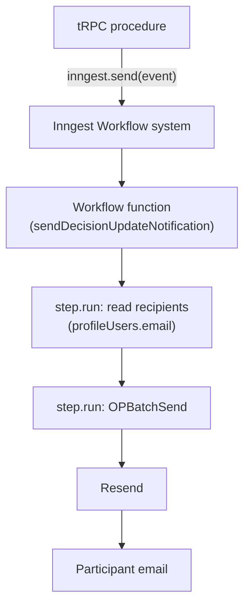
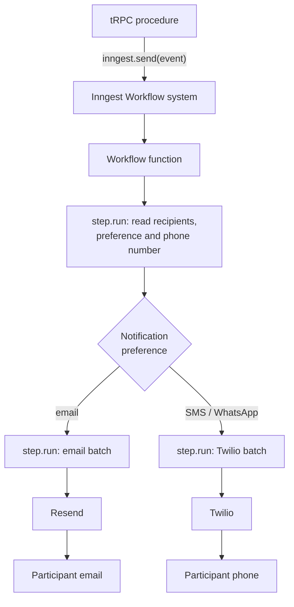

# 0003. Support Multi Modal Notifications

Date: 2026-08-25

## Status

Proposed

## Context

Participants must be able to sign up and vote through SMS and WhatsApp.
Some of them do not use email, and Common carries every notification
over email today, so those participants cannot join a process or take
part in a vote.

The current application supports email only. tRPC procedures emit
events to the Inngest Workflow system. These events trigger Inngest
Workflow functions. These Workflow functions then interact with
external services to send emails. The Workflow functions use the
Inngest `step.run` API to implement retries. Most Workflow functions
already send emails. For example, the `sendDecisionUpdateNotification`
Workflow function does this.

Today every notification ends at one channel, email:

The team has experience with Twilio, and Twilio has the features we
need for both SMS and WhatsApp.

Twilio splits those features across two products, and they carry
different obligations. Twilio Verify sends verification codes and is
exempt from A2P 10DLC registration. Programmable Messaging sends free
text and is not; its campaign review runs ten to fifteen days.

Signup needs only verification codes. Notifications need free text. The
signup flow can therefore ship before any campaign is approved, and the
notification work cannot.

## Decision

We will use Twilio as our WhatsApp and SMS provider. We will use the
existing Inngest steps for sending and retrying notifications.

For signups and phone number confirmations we will use GoTrue's
`[auth.sms.twilio_verify]` mode. GoTrue generates the code, sends it
through Twilio Verify, checks the reply, and issues the session. The
browser calls GoTrue directly.

We considered Twilio's outgoing webhook and did not use it. The webhook
would put our API host in the middle of a flow GoTrue already performs,
and would add a public route that mints sessions.

After this work, the Workflow functions will determine the user's
notification preference and send the correct notification. We will
structure these notifications as batches. We will send each batch to
the external provider and retry it with the Inngest Step API.

We will focus on implementing multi-modal support for the signup flow
first, and then on voting.

## Consequences

Every notification gains a fan-out. The Workflow function reads a
preference and sends on the channel it names:

Our server never observes a verification, so it cannot record one. A
trigger on `auth.users` writes a `phone_verifications` row when a number
becomes confirmed, and network membership reads that row.

Membership does not read `auth.users.phone_confirmed_at`. An account
holder can set that column on their own row through GoTrue, so an
account that could already sign in would be able to admit itself.

GoTrue offers seven auth hooks. None of them reports a phone
verification, which is why this is a trigger and not a hook.

Network membership admits a participant to the platform. It is not
access to an organization or to a decision. A confirmed phone number
therefore lets anyone who holds a phone create an account, which is what
self-enrollment means. An invitation still decides what that participant
sees: `assertOrgAccess` and `assertInstanceProfileAccess` require a role
on the owning profile, and a new account holds none.

Self-enrollment splits the gates in two. A gate that reads a role stays
as narrow as the role. A gate that reads membership alone widens to
everyone who can receive a text. `assertPostReadAccess` reads roles. The
comment path in `assertPostWriteAccess` reads membership alone, so any
account can comment on any organization's post. That rule predates
self-enrollment and needs a decision of its own.

We will need to store the notification preference for a user in the
database.

We will also need to store the user's phone number. Both of these
values are new. A user already on the platform will have to add their
phone number.

We will reuse the existing Inngest Workflow system, so a failed
notification retries the same way it does today. An SMS or WhatsApp
retry costs money for each attempt. An email retry does not.

One cost comes with GoTrue owning the code. No per-number send limit of
ours applies, because no request of ours carries the send. Twilio's
geographic permissions are the remaining control.

SMS autoconfirm has to stay off. With it on, GoTrue confirms a number on
a signup, and on a change, without checking a code, and the trigger
cannot tell either apart from a real verification. The row would then
admit an account that never held the number, so `enable_confirmations`
is true in every Supabase config.
