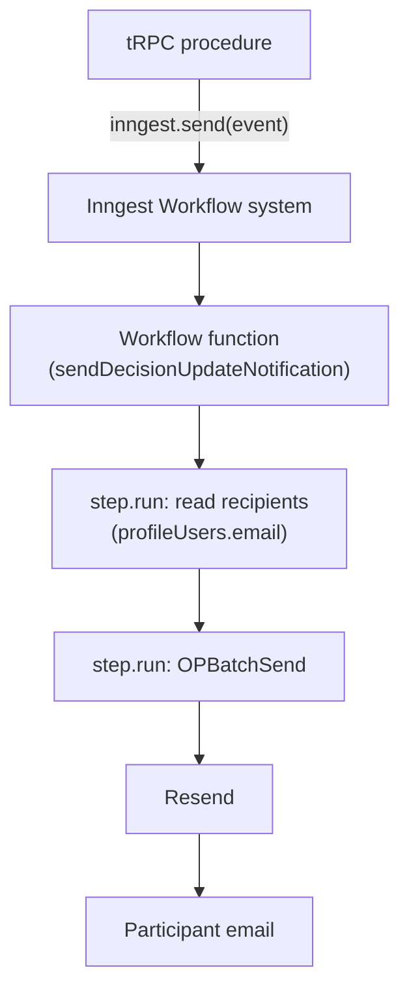
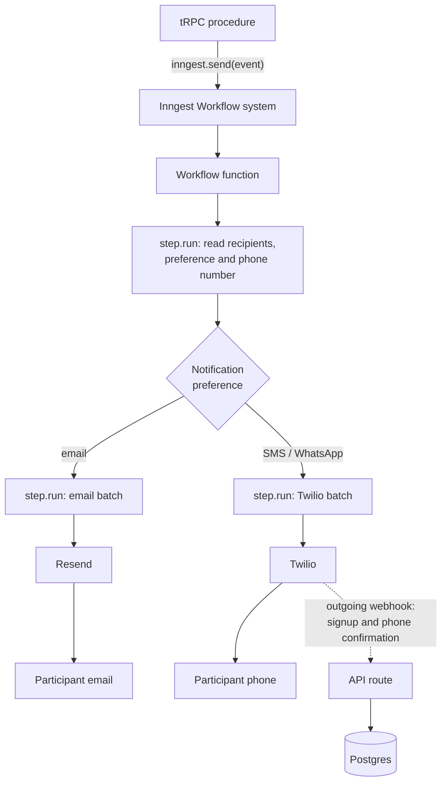

# 0003. Support Multi Modal Notifications

Date: 2026-08-25

## Status

Proposed

## Context

Participants must be able to sign up and vote through SMS and WhatsApp.
Some of them do not use email, and Common carries every notification
over email today, so those participants cannot join a process or take
part in a vote.

The current application supports email only. tRPC procedures emit
events to the Inngest Workflow system. These events trigger Inngest
Workflow functions. These Workflow functions then interact with
external services to send emails. The Workflow functions use the
Inngest `step.run` API to implement retries. Most Workflow functions
already send emails. For example, the `sendDecisionUpdateNotification`
Workflow function does this.

Today every notification ends at one channel, email:

The team has experience with Twilio, and Twilio has the features we
need for both SMS and WhatsApp.

## Decision

We will use Twilio as our WhatsApp and SMS provider. We will use the
existing Inngest steps for sending and retrying notifications.

For signups and phone number confirmations we will use Twilio's
outgoing webhook.

After this work, the Workflow functions will determine the user's
notification preference and send the correct notification. We will
structure these notifications as batches. We will send each batch to
the external provider and retry it with the Inngest Step API.

We will focus on implementing multi-modal support for the signup flow
first, and then on voting.

## Consequences

Every notification gains a fan-out. The Workflow function reads a
preference and sends on the channel it names:

We will need to store the notification preference for a user in the
database.

We will also need to store the user's phone number. Both of these
values are new. A user already on the platform will have to add their
phone number.

We will reuse the existing Inngest Workflow system, so a failed
notification retries the same way it does today. An SMS or WhatsApp
retry costs money for each attempt. An email retry does not.
