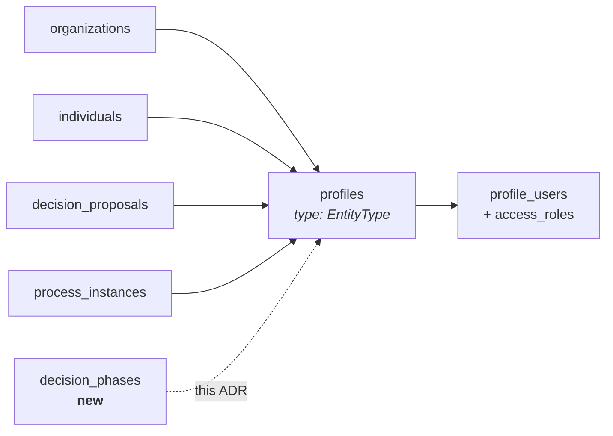

# 5. Phases are entities with their own profiles

Date: 2026-09-15

## Status

Proposed

## Context

A phase has no identity in the database. `phaseId` is a bare `varchar(256)`
denormalized across six places with **no foreign key anywhere** —
`proposal_review_assignments`, `decision_proposal_reviews`, `category_reviewers`,
`decision_transition_history.{from,to}_state_id`,
`decision_process_transitions.{from,to}_state_id`, and
`decision_process_instances.current_state_id`. Its definition lives in a JSON
array on `instance_data`, and phase order *is* array position, so editing that
array can silently dangle every one of those rows.

Per-phase authorization is nonetheless a live requirement. Authorization here is
profile-scoped all the way down — `access_roles.profile_id`,
`access_role_permissions_on_access_zones.profile_id`, `profile_users.profile_id`
— so nothing can be scoped to something that is not a profile. That gap has been
hand-rolled around three times: `category_reviewers` carries a nullable
`phase_id`, `proposal_review_assignments` is unique on a four-tuple ending in
`phase_id`, and `reviewHelpers.canReadPhaseReviews` re-derives phase read access
from `access.review` plus `openReviews` plus `isPhaseAtOrBefore`. Three bespoke
mechanisms exist because a phase cannot hold a role grant.

Two in-flight pieces of work are blocked on the same missing thing. The process
builder port needs per-phase forms, rubrics, invitees and dates. The proposals
change needs phases to be foreign-key targets before proposals can move between
them independently, and names this ADR as its prerequisite: *"nothing here starts
until it has landed."*

In this codebase an entity *is* a profile. `EntityType` is the `type` column on
`profiles`, and the established pattern is a domain table plus a profile FK:
`decision_proposals.profile_id`, `process_instances.profile_id`,
`organizations.profile_id`, `individuals.profile_id`.

**Scope: identity only.** The phase table's column set, per-proposal membership,
and replacing `current_state_id` belong to the proposals ADR, not here.

## Decision

We will make a phase an entity, following the pattern `proposals` and
`process_instances` already use.

1. **Add `EntityType.PHASE`** and mint a profile per phase at instantiation, with
   a `profile_id` FK on the phase table.
2. **Ship permission defaults in the same change as the enum value.**
   `assertProfileTypeAccess` takes `ProfileTypePolicies =
   Partial<Record<EntityType, AccessZonePermission>>`, and omitting a type means
   lenient pass-through. A new type is therefore **ungated by default**, with no
   compile error and no runtime error — just an unauthorized read that succeeds.
   `PHASE` gets an explicit policy alongside the existing
   `[EntityType.DECISION]: { decisions: permission.ADMIN }` mapping.
3. **Slugs are opaque.** `profiles.slug` is globally unique, so a phase slug
   follows `process_instances`' own scheme rather than a readable one. A profile
   does not imply a top-level URL; a phase's page stays nested under its
   decision, as a proposal's does.
4. **Deleting a phase tombstones its profile, it does not drop it.** Phase
   profiles are created and destroyed routinely — the editor has a "Delete this
   phase" control — unlike instance profiles. A profile that has accrued
   followers, comments or role grants is not safe to hard-delete, so the phase's
   `profile_id` is `onDelete: 'set null'` and the profile is retired separately.
5. **Reviewer rosters move onto phase-profile membership** — `profile_users` on
   the phase profile with a review role, resolved by the same query
   `getEligibleReviewerProfileIds` already uses one level up. The collapse is
   partial: `category_reviewers` keeps its `taxonomy_term_id` scope and loses
   only its hand-rolled `phase_id`.
6. **Migrate the six `varchar` phase references to real foreign keys.**

## Consequences

Per-phase authorization stops being three hand-rolled mechanisms and becomes the
one we already have. Phases become foreign-key targets, so reordering or editing
the phase list can no longer silently dangle review assignments, reviews or
transitions. The process builder's per-phase invitee list needs no new storage —
it is `profile_invites` plus `profile_users` against the phase profile, and
`profile_invites` already carries a `profile_entity_type` column for exactly this.

Every instance now mints a profile per phase: a five-phase process creates six
profiles instead of one. Proposals already do this at higher cardinality and at
user-facing rates, so the pattern is proven, but anything that counts or lists
profiles changes meaning.

Every future `EntityType` dispatch needs a `PHASE` answer, and the failure mode
is silent permissiveness rather than a broken build — 55 files reference
`EntityType.*`, though only five dispatch on it.

Phase deletion becomes a profile lifecycle problem rather than a row delete, and
we now own tombstoned phase profiles: they are unreachable but not gone, and
nothing yet reaps them.

Phase membership is a relationship [ADR 0002](./0002-process-participant-for-notifications.md)
does not know about. It defines a Participant as someone who is a member of the
*process*, or who started, submitted or was invited to collaborate on one of its
proposals — derived, never subscribed, and explicitly lasting "across all
phases". Someone invited to a single phase and nothing else satisfies none of
those clauses, so they would be a phase member with role grants who receives no
process notifications. Either phase membership implies process participation, or
0002's derivation gains a clause. That is a decision for whoever builds per-phase
invitations, and it should not be discovered by a reviewer who never got an
email.

---

*Numbering note: an open pull request adds a `0002-proposals-hold-their-own-phase.md`,
which collides with the merged `0002-process-participant-for-notifications.md`.
That ADR predates 0002–0004 and needs renumbering before it merges; this one
takes 0005 and refers to it by name rather than number.*
