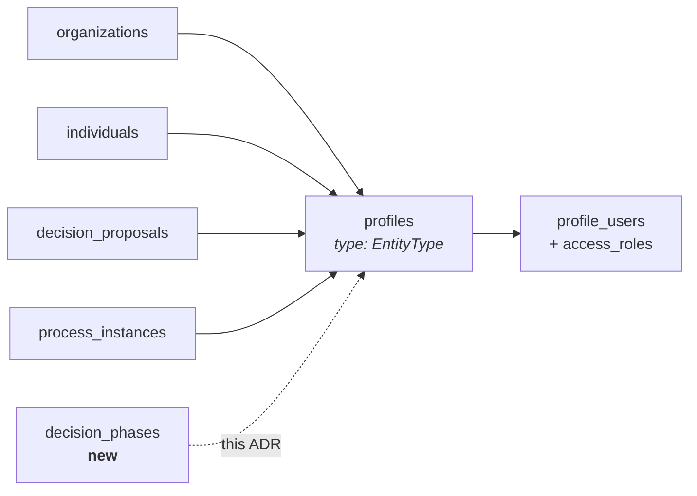

# 5. Phases are entities with their own profiles

Date: 2026-09-15

## Status

Proposed

## Context

A phase has no identity in the database. Its definition lives in a JSON array on
`decision_process_instances.instance_data`, phase order *is* array position, and
every reference to a phase is a bare `varchar` with no foreign key — so editing
that array can silently dangle the rows that point into it.

Per-phase authorization is nonetheless a live requirement, and authorization here
is profile-scoped throughout. Nothing can be scoped to something that is not a
profile, so per-phase access control has been hand-rolled around that gap rather
than expressed with the mechanism we already have.

## Decision

A phase is an entity with its own profile, following the pattern
`decision_proposals` and `process_instances` already use: a domain table holding
a `profile_id` foreign key, under a new `EntityType.PHASE`.

Per-phase authorization is then `profile_users` and `access_roles` against the
phase profile. Reviewer rosters become phase-profile membership, and phase
references become real foreign keys.

**Scope: identity only.** The phase table's column set, per-proposal membership,
and replacing `current_state_id` belong to the proposals ADR.

## Consequences

Per-phase authorization stops being a set of bespoke mechanisms and becomes the
one we already have. Phases become foreign-key targets, so reordering or editing
the phase list can no longer silently dangle review assignments, reviews or
transitions. A per-phase invitee list needs no new storage — it is
`profile_invites` plus `profile_users` against the phase profile.

Every instance now mints a profile per phase: a five-phase process creates six
profiles instead of one. Proposals already do this at higher cardinality, so the
pattern is proven, but anything that counts or lists profiles changes meaning.

Every future `EntityType` dispatch needs a `PHASE` answer, and the failure mode
is silent permissiveness rather than a broken build.

Phase deletion becomes a profile lifecycle question rather than a row delete.
Phases are created and destroyed routinely, unlike instances, and a profile that
has accrued followers, comments or role grants is not cheap to discard. The
mechanism is unsettled and belongs with whoever builds phase editing.

Phase membership is a relationship [ADR 0002](./0002-process-participant-for-notifications.md)
does not know about. It defines a Participant as someone who is a member of the
*process*, or who started, submitted or was invited to collaborate on one of its
proposals — derived, never subscribed, and explicitly lasting "across all
phases". Someone invited to a single phase and nothing else satisfies none of
those clauses, so they would be a phase member with role grants who receives no
process notifications. Either phase membership implies process participation, or
0002's derivation gains a clause.
