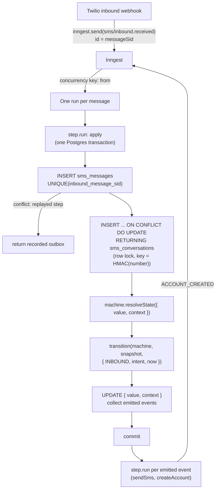

# xxx. Persist SMS conversation state in Postgres with XState; Inngest runs one step per message

Date: 2026-09-25

## Status

Proposed

## Context

Inbound SMS is a conversation: a person texts, we reply, they reply. Signup
needs one exchange (consent). Voting and proposal listing need several. Every
message arrives as the same Inngest event, `sms/inbound.received`, keyed only
by the sender's number.

The first design held the conversation in one Inngest run: trigger on the
inbound event, `step.waitForEvent` for the reply, guarded by `debounce` and
`singleton` on the number. Review of #2161 found it sends the consent text
twice. The cause is a guarantee Inngest does not give:

- A run parked in `waitForEvent` owns no queue item. The queue releases the
  singleton lock when a run's last item dequeues (`dequeue.lua`: "We just
  dequeued the last step"). Concurrency limits exclude waiting runs by
  documented design. No Inngest primitive holds "one live conversation per
  key" across a wait.
- The reply is the same event type as the trigger, so it starts a new run.
  Filtering it out needs the current state of the conversation, which the
  run cannot share.
- A wait registers when execution reaches it. A message that arrives between
  the transition and the next wait is not delivered to the run.

## Decision

We will store conversation state in Postgres and run one short Inngest run
per inbound message. Inngest keeps webhook dedupe, retries, and per-sender
serialisation (`concurrency` keyed on the number). It no longer holds state
or waits.

We will express the conversation as an XState v5 machine and evaluate it with
the pure `transition()` function inside a `SELECT ... FOR UPDATE` transaction.
The machine uses `assign` and `emit` only: no `invoke`, `spawn`, or `after`.
Emitted events are the outbox; the runner executes them after commit. Expiry
is a guard on `event.now`, evaluated on the next message.

We will persist `{ value, context }` as two JSON columns and restore with
`machine.resolveState`, with a `machine_version` column. We will not persist
XState's internal snapshot.

We will key each conversation row by `HMAC-SHA256(secret, E.164 number)`,
prefixed with a key version. The row does not store the number. Replies use
the inbound event's `from`; outbound messages resolve the number through
`auth_user_id`.

## Consequences

Two runs for one number cannot both send: the row lock serialises them and
`UNIQUE(inbound_message_sid)` makes a replayed step a no-op. No run outlives
a message, so a deploy cannot strand a conversation mid-step. State is
queryable in SQL.

Voting and listing are child states under `active`, added to the machine
without changes to the runner. The transition function is unit-tested with
`transition()` alone; the store is integration-tested against a real
`auth.users` row.

We add a dependency (`xstate`, no transitive dependencies), a schema
migration, a dedicated secret, and a retention job for message rows and
abandoned conversations. A machine change needs a version bump and a
context migration for rows in `active`.

Open: how a message names a decision (keyword, per-decision number, or
invitation before first contact). This decides whether `context` carries a
`processInstanceId`.
