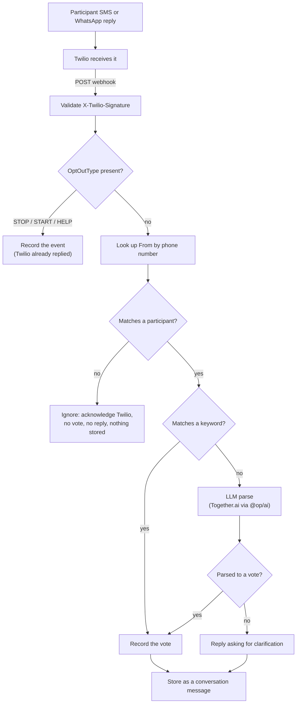

# Spike: LLM-assisted SMS reply parsing and message generation

Asana task: [Spike: LLM-assisted SMS reply parsing and message generation](https://app.asana.com/1/1108348036672214/project/1215095416548883/task/1218639500939064)

Status: research in progress. This document has no recommendation yet.

## Scope

The spike covers two places an LLM could sit in the SMS system:

- Inbound: parse a free-text SMS reply into a structured vote, instead of
  matching a fixed keyword.
- Outbound: generate or personalize notification copy, instead of sending a
  static template, at the point the Twilio adapter sends from.

The team has added a third requirement: store the LLM-based conversation
whenever a user starts one, from the web application, from SMS, or from
WhatsApp. This is wider than the Asana task's original title. The
original task did not name the web application. ADR 0004 names WhatsApp
as a target channel, but this spike's task did not name it either. This
document tracks the requirement as given. The Asana task should be
updated to match.

## How Twilio delivers an inbound SMS reply

Twilio receives the reply on its own infrastructure. It then makes a
synchronous HTTP request to a webhook URL we configure on the phone
number or Messaging Service. We configure that webhook in the Twilio
Console or through the REST API.

The request uses `application/x-www-form-urlencoded` form data. It carries
`MessageSid`, `AccountSid`, `From`, `To`, `Body` (up to 1600 characters),
`NumMedia`, `NumSegments`, and geographic fields such as `FromCity`.

Twilio signs each request with an `X-Twilio-Signature` header. The signature
is an HMAC-SHA1 hash of the full URL and the sorted parameters, keyed by the
account auth token. Twilio's own guidance says to validate this signature
with its SDK, not with a hand-written check, because the parameter set can
change.

Our handler must answer with TwiML: an XML document with a `<Response>` root
element and `Content-Type: text/xml`. An empty `<Response/>` is valid when we
have nothing to send back synchronously. Twilio's public docs do not state
an exact timeout or retry policy for messaging webhooks. Confirm this with
Twilio support or the console before a synchronous-processing design depends
on it.

## Inbound handling: compliance and edge cases

An inbound handler cannot go straight from a raw `Body` to vote parsing.
Four things must happen first or alongside it.

This is the shape the subsections below argue for, not a decided design —
the exact keyword set is still open.

### Opt-out keywords must be checked before any vote parsing

Twilio's Advanced Opt-Out feature matches STOP, UNSUBSCRIBE, END, QUIT,
STOPALL, REVOKE, OPTOUT, and CANCEL, plus START and HELP, at the
Messaging Service level. When it matches, Twilio sends the confirmation
reply itself. For an opt-out, it also blocks all future sends to that
number. A later send attempt then fails with error 21610, which the
Twilio adapter already maps to `opted_out`.

If the Messaging Service still has an inbound webhook configured, Twilio
also POSTs to it. That request adds an `OptOutType` parameter (`START`,
`STOP`, or `HELP`) so we can record the event. Twilio has already replied
to the user at that point, so our handler must not reply again.

The inbound handler must check `OptOutType` before running keyword or LLM
vote parsing. It must never treat an opt-out message as an unparseable
vote reply. Whether Advanced Opt-Out is enabled on our Messaging Service
is not yet confirmed. It is an explicit opt-in Twilio feature, not a
default.

### A multi-segment reply arrives as one reassembled message

Twilio segments and bills a reply over 160 GSM-7 characters (70 UCS-2) as
multiple parts. It reassembles them before calling the webhook. The
handler receives one request, with the full text in `Body` and the part
count in `NumSegments`. No extra reassembly work is needed in our code.

### No path exists from a phone number to an identity

Confirmed absent: no `findByPhone`, no `.where(eq(phone, ...))`, no query
anywhere in the repository that resolves a phone number to a `profiles`
or `authUsers` row. Phone sign-in today runs entirely through GoTrue's
phone-OTP flow from the browser. The app server only ever reads `phone`
off an already-authenticated session's JWT claims
(`services/api/src/utils/userFromClaims.ts`). It never uses `phone` as a
search key. `profiles.phone` is not indexed or unique the way
`authUsers.phone` is.

An inbound webhook's `From` number would need a new lookup. The team has
decided the behavior for a number that matches nobody: ignore the event.
No vote is recorded, no conversation is stored, and no reply is sent. The
handler still must return a valid TwiML response to Twilio's own HTTP
request. Ignoring the event means skipping our application logic, not
skipping Twilio's response contract.

This decision has a cost worth naming. A participant might not have
verified a phone number yet, or might be texting from a number that does
not match the one on file. That participant gets silently dropped, the
same as actual spam and wrong numbers. Nothing in this repository today
gives them another way to find out their reply went nowhere.

### No rate limiting bounds inbound message volume

`services/api/src/lib/rateLimited.ts` and its `withRateLimited` tRPC
middleware are the only rate limiter in the repository. It is an
in-memory map keyed on IP and route, used on pre-auth endpoints such as
login. It does not survive multiple server instances. Every inbound
Twilio webhook call also arrives from Twilio's own IPs, not the end
user's. This limiter cannot bound how many messages one phone number
sends. No phone-keyed or durable rate limiter exists anywhere in the
repository. Bounding the LLM spend that a single flooding sender could
cause needs new infrastructure, not a reuse of the existing pattern.

## Current state of this repository

### Outbound SMS sending exists, and nothing calls it

`packages/common/src/services/notification/` defines a vendor-neutral
`SmsProvider` interface and a Twilio adapter (`providers/twilio.ts`). The
adapter sends through a Messaging Service SID, which A2P 10DLC requires.
It maps Twilio error codes to internal failure reasons such as
`rate_limited`, `opted_out`, and `invalid_number`. No Workflow function
calls `sendSms` yet.

### Phone verification bypasses our server

Signup and phone confirmation use GoTrue's `[auth.sms.twilio_verify]` mode,
configured in the Supabase TOML files. GoTrue generates the code, sends it
through Twilio Verify, checks the reply, and issues the session. Our server
never sees the code or the verification.

### No inbound Twilio webhook exists

No route in `apps/api` or `apps/app` handles an inbound Twilio request.
The closest existing pattern is the moderation vendor webhook at
`apps/api/app/api/v1/moderation/webhooks/route.ts`. It reads the raw body
and checks a shared secret in a query parameter. It delegates to a
handler in `@op/api`. It returns a bare 500 on any unhandled error, so
the vendor retries. A new inbound-reply route would follow this shape,
but would validate Twilio's `X-Twilio-Signature` instead of a static
secret.

### ADR 0004 rejected a webhook for signup only, not for notifications

[ADR 0004](../adr/0004-support-multi-modal-notifications.md) covers both
flows. It picks Twilio as the provider for signup verification and for
notifications. It routes notification sends through the existing Inngest
Workflow steps. Only one part of it is signup-specific: the decision to
reject Twilio's outgoing webhook. That rejection applies to the signup
and verification flow alone. The webhook would place our API inside a
flow GoTrue already owns, and would add a public route that mints
sessions.

The rejection does not cover an inbound vote-reply webhook: a vote reply
carries no session and no identity claim. ADR 0004 is silent on inbound
vote replies, so this spike is not re-litigating a closed question.

### A status-callback webhook is anticipated but not built

`.env.local.example` states that `TWILIO_AUTH_TOKEN` "also signs the inbound
status-callback webhook", so the variable is required even where outbound
sends use a scoped API key. This callback reports delivery status
(delivered, failed, undelivered) for messages we send. It is a different
route from the inbound vote-reply webhook this spike covers. One reports
on messages we sent. The other carries messages a participant sent us.
Both would validate the same Twilio signature scheme and could share
validation code.

The same file labels this configuration block "ADR 0003" in a comment.
The correct reference is ADR 0004; ADR 0003 covers pagination envelopes
and is unrelated. A second comment repeats the same mislabel, in
`packages/common/src/services/notification/types.ts`. Both are one-line
fixes, tracked separately from this spike.

### Region selection does not apply to inbound webhooks

ADR 0004 records a future multi-region client factory for outbound sends,
keyed by the recipient's country calling code. An inbound webhook has one
fixed URL per Twilio number or Messaging Service; Twilio does not route an
inbound request through a region we select. The two concerns do not
conflict.

## LLM tools and libraries

### Provider decision: Together.ai

The team has decided to use [Together.ai](https://www.together.ai) as the
inference engine for this spike, through its OpenAI-compatible API.

### Three partial paths already exist in this repository

The repository has three pieces of LLM-provider infrastructure. None of
them has a working caller today.

- **`@op/ai`** (`packages/ai/`). A tested, provider-agnostic package built
  on the Mastra agent framework (`@mastra/core`). It calls any
  OpenAI-compatible chat-completions endpoint, configured at runtime through
  `AI_BASE_URL` and `AI_API_KEY`. No code imports `@op/ai` yet.
- **`ai` and `@ai-sdk/anthropic`** (`services/api/package.json`). The
  Vercel AI SDK with its native Anthropic provider. No file in the
  repository calls `generateText`, `generateObject`, `streamText`, or
  `streamObject` from this package. Treat it as an unused dependency, not a
  working integration.
- **A documented router that does not exist.** `services/api/README.md`
  describes an `llm` tRPC router at `src/routers/llm/chat.ts` that
  "integrates with Anthropic models." No such file or directory exists
  under `services/api/src/routers`. This is a stale or aspirational doc
  entry, tracked separately from this spike.

### `@op/ai` already fits Together.ai; the other two paths do not

`@op/ai` sends a plain OpenAI chat-completions request: `POST
${AI_BASE_URL}/chat/completions`, header `Authorization: Bearer
${AI_API_KEY}`, and a JSON body of `{ model, messages, stream }`.
`packages/ai/src/agent.test.ts` asserts this wire shape against a mocked
`fetch`. Together.ai's OpenAI-compatible API is `https://api.together.ai/v1`,
the same `/chat/completions` path, the same Bearer auth header, and it
accepts the same body shape. Pointing `@op/ai` at Together.ai needs no
code change. Set `AI_BASE_URL=https://api.together.ai/v1` and
`AI_API_KEY=<Together API key>`, and pass a Together model id. Together
namespaces model ids as `provider/model-name`, for example
`meta-llama/Llama-3.3-70B-Instruct-Turbo`. An OpenAI model string like
`gpt-4o` returns a 404 there.

`@op/ai` re-exports the raw Mastra `Agent` type from `createAIAgent`. A
caller gets a full Mastra agent, not a restricted wrapper. Mastra's
structured-output and tool-calling options are available on it, as long
as the underlying provider supports them. Together.ai supports both: its
`response_format` parameter (JSON mode) and its `tools`/`tool_choice`
parameters (function calling) both work, following the same shapes OpenAI
defines. Support for either is model-dependent on Together's platform.
Confirm the chosen model supports one of them before relying on it for
the inbound path's structured extraction.

The other two paths do not fit this decision. `@ai-sdk/anthropic` calls
Anthropic's native API, not an OpenAI-compatible endpoint — it cannot
target Together.ai. The Vercel AI SDK does ship a separate
`@ai-sdk/openai-compatible` provider that could, but it is not a
dependency of this repository today. `@op/ai` already speaks the exact
wire format Together.ai expects, and it is already tested and
workspace-local. It is the path to build on. This resolves the earlier
open question about which of the three paths to use.

### No existing keyword or regex classifier to compare against

The spike's inbound question asks whether a keyword-first, LLM-fallback
design bounds the risk of a misread vote. No such keyword or regex
classifier exists anywhere in this repository today, for SMS or otherwise.
The nearest structural precedent is the moderation vendor adapter
(`packages/common/src/services/moderation/providers/checkstep.ts`). It
Zod-validates a vendor payload at the boundary and maps it to a small
internal enum. A keyword-first vote parser would follow the same shape:
a strict Zod boundary. The LLM call would stand in for the vendor when
the keyword match fails.

### A fixed keyword set only bounds risk for one language

The app ships eight locales: `ar`, `bn`, `en`, `es`, `fr`, `hu`, `pt`, and
`so` (`packages/common/locales.mjs`). Locale resolution for the web UI is
purely URL-path and browser-driven, through `next-intl` middleware. No
`locale` or `preferredLanguage` column exists on `profiles` or
`authUsers`; the app has no persisted, per-participant language today. A
separate DeepL-backed service translates content
(`packages/common/src/services/translation/`), but it is not tied to a
participant's identity and does not feed this problem.

A keyword-first design built on English keywords (`YES`, `NO`) only
bounds misread risk for participants replying in English. A participant
replying in Arabic or another supported locale would miss the keyword
match on every reply. Every one of their messages would fall through to
the LLM instead. That undercuts both the cost savings and the
correctness argument the keyword-first design is meant to provide.
Closing this gap needs either a localized keyword set per language or a
stored per-participant language, neither of which exists yet.

### Structured extraction for the inbound path

Parsing a free-text reply into a vote is a classification task: a small,
closed output shape (which proposal, which choice, or "unparseable").
Together.ai's OpenAI-compatible API supports two ways to force that
shape, mirroring OpenAI's own:

- **JSON mode** (`response_format`): constrains the response to a JSON
  schema.
- **Function calling** (`tools` / `tool_choice`): guarantees the call
  arguments validate against the schema.

Either removes the need to parse free-form model text with a second regex
layer, through Mastra's structured-output options on the `Agent` instance
`@op/ai` returns. Support for `response_format` and `tools` is
model-dependent on Together's platform. The specific model chosen for
this path must be confirmed to support one of them.

### Cost and latency at this task's shape

A classification call over a short SMS body is a small request regardless
of model. Twilio caps `Body` at 1600 characters, and a real reply is far
shorter. Together.ai hosts many models at different sizes and prices. A
concrete cost-per-message and latency figure depends on which model is
chosen for this path. That choice is still open. The latency question
matters more than cost here. A non-streaming call to a small model
usually returns in one to two seconds. This spike's open question about
Twilio's exact timeout (see above) decides whether that fits inside one
synchronous webhook request. If it does not fit, parsing must move to the
async Inngest path outbound sends already use.

### Generation for the outbound path

Generating notification copy is not latency-bound the way inbound parsing
is: nothing is waiting on a synchronous webhook response. It can run ahead
of send time, inside the existing Inngest step that already builds and
sends each batch. This removes the inbound path's timeout pressure from
the outbound half of the spike entirely.

## Storing a conversation across web, SMS, and WhatsApp

### No conversation storage exists today

`services/db/schema/tables/` has no `conversations`, `messages`, `chat`, or
`thread` table. It has no `channel` concept either — grepping the schema
and `packages/common/src/services/notification/` for `whatsapp` or
`channel` returns nothing. The notification package today only models
SMS: a `PhoneNumber` type, an `SmsProvider` interface, and the Twilio
adapter. A channel enum covering web, SMS, and WhatsApp would be new
vocabulary, not an extension of something that exists.

### ADR 0004's phone and preference storage is still unbuilt

`profiles` already has a `phone` column, but it is a contact-info field on
the org/individual profile entity, unrelated to a per-membership
notification phone number. `profileUsers` — the membership row ADR 0004's
fan-out reads from — has no phone column and no notification-preference
column. ADR 0004's statement that both are still needed holds today.

### This repo's precedent favors a concrete shape over a bare polymorphic one

A conversation started from the web app is tied to a `profileUsers` row
with a real foreign key. One started from SMS or WhatsApp is tied to a
phone number, which is not a foreign key to anything today. The repo has
two contrasting existing patterns for "this row can point at one of
several different kinds of thing":

- **Bare polymorphic, no FK**: `moderationFlags` and `moderationSubmissions`
  use an `itemType` enum (`PROPOSAL | POST | USER`) plus a bare `itemId`,
  with no foreign key. The flag only needs to record the target for an
  audit trail, not enforce it at the database level.
- **Concrete per-relationship table with real foreign keys**:
  `proposalRelationships` is a dedicated table for one specific
  relationship shape, proposal to proposal. It has composite foreign keys
  on both ends, and is kept separate from the generic
  `profileRelationships` and `organizationRelationships` tables. The
  header comment there gives the reason: a shared polymorphic table
  cannot express each shape's own delete semantics and constraints.

A conversation's origin needs a real foreign key on the web case: it must
resolve to an actual `profileUsers` row. On the SMS or WhatsApp case, it
needs only a phone number. That asymmetry matches the second pattern, not
the first. The direction is a `channel` enum on a `conversations` table,
with a nullable `initiatedByProfileUserId` foreign key. That key would be
set, and constrained, only when `channel = web`, rather than one generic,
FK-less origin column covering all three channels. This is a direction
from precedent, not a finished schema — the exact column set is a design
task, not a research one.

### WhatsApp is not "SMS with a different channel label"

WhatsApp Business messaging, through Twilio, carries a compliance model
SMS does not have. Each inbound message from a participant opens a
24-hour customer service window. Inside it, we can send free-form text
and media, up to 1024 characters. Outside that window, only a
pre-approved message template can be sent, capped at 550 characters.
Twilio returns error 63016 if free text is attempted. Template approval
is a Meta review process, not something Twilio or our code controls.

This bears directly on the outbound path's LLM-generated copy. On
WhatsApp, it is only usable as free text inside the 24-hour window that a
participant's own reply opens. Outside that window, the choice is
between two options. Submit generated copy as a pre-approved template
ahead of time — a content-approval workflow, not a runtime one. Or do not
send on WhatsApp at all for that message. A single `channel` enum value
for WhatsApp on the `conversations` table records which channel a
message used. By itself, it does not express this constraint anywhere
the sending code would see it.

### Vote reply and conversation are not yet the same concept

The Asana task's original scope treats an inbound SMS as a one-shot vote
parse. The conversation-storage requirement treats an inbound message as
part of a stored, possibly multi-turn thread. Nothing in this document,
or in the codebase, states which of two shapes a vote reply takes. It
might be a conversation of one message, tied to the proposal it voted
on. Or vote parsing might be a separate concept. It writes to whatever
vote-recording tables the reply-to-vote path builds. Conversation storage
would then be a parallel, generic log alongside it.

This choice is not just naming. It decides whether `conversations`
carries a nullable proposal or decision foreign key. It also decides
whether the vote-parsing code and the conversation-storage code are the
same write path, or two.

### Storage is a separate question from the logging rule

`packages/logging/README.md` bars a log line from carrying a raw client
IP. The same goes for anything else that identifies a person directly:
an email address, a token, a request body. It says to log the id we
already store instead. A phone number falls in that same category. This
is a constraint on what a log statement may print through `@op/logging`.
It says nothing about what may live in a Postgres row. Storing a phone
number and a message transcript in a `conversations` table does not
violate it. That holds provided no code path later logs that row's
content through the shared logger.

The README also states that log retention is set in PostHog project
settings, not in this repository. A stored conversation transcript has
no such setting. Retention for it is an open design question this repo
does not answer anywhere today.

## Open questions

- Twilio's exact timeout and retry policy for a messaging webhook, confirmed
  with Twilio rather than assumed from other webhook types.
- Whether inbound parsing must run outside the webhook request, given the
  TwiML response deadline.
- Whether it should hand off to the existing Inngest Workflow system the
  way outbound sends do.
- Cost and latency per message at the volume SMS Notifications targets.
- Whether a keyword-first, LLM-fallback design bounds the risk of a
  misread vote.
- Which specific Together.ai model to use for inbound parsing, and
  whether it supports `response_format` or `tools`.
- Cost and latency for that specific model, once chosen.
- The `conversations` schema: the channel enum, the per-channel columns,
  and the v1/v2 relation blocks it needs — a design task this document
  only points toward.
- Whether a conversation is scoped to one proposal or vote, or is generic
  across the app.
- Whether the web, SMS, and WhatsApp requirement belongs in this Asana
  task or a separate one.
- Retention for a stored conversation transcript, since PostHog log
  retention settings do not cover data stored in Postgres.
- Whether Advanced Opt-Out is enabled on our Twilio Messaging Service, and
  if not, who owns turning it on before an inbound webhook ships.
- Whether the silent-drop decision needs a mitigation for a not-yet
  verified phone: that participant gets no signal their reply went
  nowhere.
- The design for a durable, phone-number-keyed rate limit on inbound
  messages, since the existing IP-keyed, in-memory limiter cannot cover
  this case.
- Whether to close the keyword-first design's single-language gap with
  localized keywords, a stored language per participant, or accepting a
  narrower bound for non-English replies.
- How WhatsApp template approval (a Meta review process) fits generating
  copy at send time, for messages sent outside the 24-hour session
  window.
- The build, defer, or drop recommendation this spike must produce.
