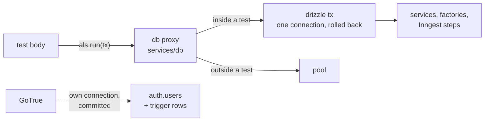
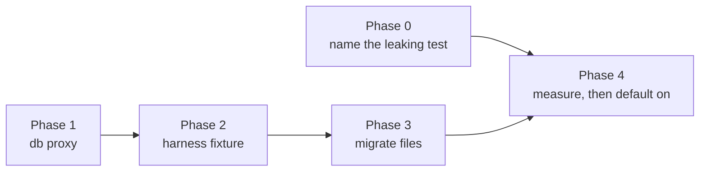

# Integration tests: per-test transactions

- Harness: `packages/common/testing/` (`vitest.ts`, `setup.ts`, `globalSetup.ts`)
- Database client: `services/db/index.ts`
- Scope: the Vitest integration projects in `packages/common`, `services/api`
  and `services/workflows`. Playwright and `services/realtime` are out.
- Branch: this plan is written against `dev`. `TestPhoneAuthDataManager`,
  `SmsVotingFixture` and the `services/workflows` integration suites it
  names arrive with the SMS stack (#2161, #2199); the steps that touch them
  wait for that stack to merge. Everything else applies to `dev` today.

## The problem

Every integration test writes to one shared Postgres with no transaction and
no wipe. Two workers (four in CI) and `describe.concurrent` run tests side by
side. Isolation depends on two conventions: unique names carrying `task.id`,
and `onTestFinished` cleanup through the data managers. When either slips:

- a row written by one test is visible to another, so a count, a page walk or
  an ordering assertion over a shared table flakes;
- a row nobody deletes fails the whole run at `globalSetup.teardown`, which
  checks that every table is empty and does not name the test that leaked.

Rows come from two places. The services write through the `db` singleton in
`services/db/index.ts`. GoTrue writes `auth.users` through its own
connection, and the signup trigger adds `users`, `profiles` and
`profileUsers` rows in GoTrue's transaction. A test transaction can hold the
first kind. It can never hold the second: a session only works for a
committed user, and 117 of 223 files create one.

## The design

1. `db` becomes a proxy. Every property read resolves to
   `als.getStore() ?? realDb`, where `als` is an `AsyncLocalStorage` holding
   a drizzle transaction. Services keep calling `db.query`, `db.select`,
   `db.transaction`. Inside a test, `db.transaction(cb)` runs on the
   transaction object, which drizzle turns into a savepoint, so the
   services that open transactions are unchanged: 23 call sites in 21
   files under `services/decision` alone (`symbolic`:
   `calls(F, _, member(db, transaction, _), File, _)`), 51 across
   `packages/common` and `services/api`. Four services lock rows with
   `FOR UPDATE` (`lockProcessInstance.ts:36`, `advancePhase.ts:102`,
   `submitManualSelection.ts:177`, `revertPhase.ts:241`); the lock lives
   on the test's connection and is released by the rollback.
2. The harness exports `it` and `test` built with `test.extend`. The fixture
   opens a transaction, calls `als.run(tx, () => use(tx))`, and rolls back
   when `use` returns. Vitest runs the test body inside `use`, so the
   context reaches the body, the factories, and the steps that
   `InngestTestEngine.execute` runs. A `beforeEach` cannot do this; it runs
   in a different async context from the test.
3. Test files import `it` from the harness instead of `vitest`.
4. The data managers stop deleting data rows and keep deleting auth users.
   The teardown check stays as the backstop for the auth side.

## Phases

Phase 0 is independent and lands first. Phases 1 to 3 are sequential.
Phase 4 is a measurement gate before the switch is on by default.

### Phase 0: name the leaking test

Half a day. Fixes the half transactions cannot reach, and makes today's
failure diagnosable.

- Every factory that creates an auth user registers the id with one tracker
  in `packages/common/testing`, keyed by `task.id`. The entry points on
  `dev` (`symbolic`: `calls(F, _, member(_, signUp, _), File, Line)` and
  `member(_, createUser, _)`): `createTestUser` (`supabase.ts:20`,
  `auth.signUp`), `createUser` (`data/test-data.ts:67`,
  `auth.admin.createUser`), the sign-up helpers in
  `helpers/loginTestUtils.ts:28` (`auth.signUp` on an isolated client), and
  `createGatingCallers` (`services/api/src/test/helpers/gating/callers.ts:171`,
  with its delete at line 62). `TestPhoneAuthDataManager.createUser` joins
  the list when the SMS stack merges.
- The managers embed `task.id` in the email they generate. The gating
  callers do not — they name users `gating-<uuid>@…` — and neither does
  `loginTestUtils`. Both get the id in the address, or the teardown names
  nothing for the 103 gating files.
- `globalSetup.teardown` reports, for each leftover `auth.users` row, the
  `task.id` found in its email or its phone number, before it throws.
- Done when a deliberately leaked user fails the run with the test's id in
  the message.

### Phase 1: the `db` proxy

One day, in `services/db`.

- `services/db/testTransaction.ts`: an `AsyncLocalStorage<DbTransaction>`
  and `runInTestTransaction(fn)`, which opens `realDb.transaction`, runs
  `fn` inside `als.run`, and throws a sentinel at the end so drizzle rolls
  back. It is a test seam; production never calls it.
- `services/db/index.ts`: `db` is `new Proxy(realDb, { get })` returning the
  property from the store's transaction when one is set. `db.query`,
  `db._query`, `db.select`, `db.insert`, `db.transaction` and `db.execute`
  must all forward. Keep `realDb` exported for migrations and seeding.
- Pool settings: a running test pins one connection for its whole duration.
  Vitest runs up to five tests at once per file (`maxConcurrency`); the test
  pool is `DB_POOL_MAX: 4`. Raise it above `maxConcurrency` per worker, or a
  test waits on a connection a sibling holds until the 30 s timeout.
  `idle_in_transaction_session_timeout` is 60 s and `testTimeout` 30 s, so
  the server never kills a live test transaction first.
- `@op/db/test` is not imported by any service
  (`import_decl('@op/db/test', File, Line)` → none under
  `services/decision`), so the proxy wraps the only path.
- Tests, in `services/db`:
  - a write inside `runInTestTransaction` is invisible to `realDb` and gone
    after it returns;
  - a service that calls `db.transaction` inside it gets a savepoint: a
    thrown error rolls back the savepoint and the outer transaction still
    holds the rows written before it;
  - two concurrent `runInTestTransaction` calls do not see each other;
  - outside the store, `db` is the pool;
  - a read or write the service does not await, so it runs after the
    rollback released the connection, fails the test loudly rather than
    disappearing. There is one such site today: `submitReview.ts:134`
    wraps a `db.select({ value: count() })` on `proposalReviewAssignments`
    in `waitUntil`. The other twelve `waitUntil` sites in
    `services/decision` call analytics, `event.send` or a cache
    invalidation, none of which touch `db`. The proxy test uses the
    `submitReview` shape, and the service gets its fix in the same PR.

### Phase 2: the harness fixture

Half a day, in `packages/common/testing`.

- `packages/common/testing/it.ts`: `export const it = base.extend({ tx })`
  and `test = it`, where the `tx` fixture wraps `use` in
  `runInTestTransaction`. `describe` stays vitest's.
- `services/workflows/testing/setup.ts` needs nothing; the fixture is an
  import, not a setup file.
- Auth cleanup runs after the rollback, in the fixture, on the real pool.
  A manager that deletes the trigger-made `profiles` row through `db`
  deletes it inside the transaction, and the rollback brings it back.
  `users.authUserId` is `ON DELETE CASCADE`, so the `users` row goes with
  the auth user; `profiles` has no key to `auth.users` and does not. So
  the fixture, after `use` returns and the transaction is rolled back:
  deletes every auth user the test registered through the admin client,
  then deletes their profiles through `realDb`. The managers register ids
  with the tracker from Phase 0 and stop deleting rows themselves. The
  deletes to move (`symbolic`: `calls(F, _, member(db, delete, _), File,
  Line)` on `packages/common/testing`): `TestProfileUserDataManager` ×4,
  `TestOrganizationDataManager` ×2, `TestJoinProfileRequestDataManager` ×2,
  `TestDecisionsDataManager` ×2 (lines 793 and 800),
  `TestTranslationDataManager` ×1, `loginTestUtils` ×2. The seven in
  `globalSetup.teardown` stay on the real pool. (The manager comment that
  `users` must be deleted before the auth user is wrong; the cascade
  handles it.)
- Prove the context reaches Inngest steps before this phase is done, not
  in Phase 3: one ballot test reads its vote row back inside the test and
  sees it, then checks through `realDb` after the test that it is gone.
  `InngestTestEngine.execute` runs steps as promise continuations of the
  test body, which `AsyncLocalStorage` follows; a detached scheduler
  would not, and this test is what tells the two apart.
- Confirm the extended `it` keeps `.concurrent`, `.sequential`, `.each`
  and `.only`; the 125 concurrent files and 6 sequential tests depend on
  them, and a codemod that swaps the import would break them silently.
- Opt-in: a file that imports `it` from `@op/common/testing` gets the
  transaction; one that imports from `vitest` behaves as today. This lets
  Phase 3 land file by file.

### Phase 3: migrate the files

One PR per package, a codemod for the import line, then review by hand of
the files the codemod flags.

- 223 files: replace `import { … it, … } from 'vitest'` with the harness
  import. A codemod handles the import; `describe`, `expect`, `vi` keep
  coming from vitest.
- Files to review by hand:
  - the 58 `services/api` files with raw `db.insert` / `db.update` keep
    working (they go through the proxy), but their inline `onTestFinished`
    deletes can go;
  - `recipients.test.ts` and `listReviewAssignmentLocations.test.ts` write
    rows on purpose through raw inserts and stay as they are;
  - the gating cells create users through `createGatingCallers`; auth
    cleanup stays;
  - `realtime` is not migrated. Its tests read through Supabase Realtime,
    which cannot see an uncommitted row.
- Done when `pnpm test` passes with every integration file on the harness
  `it`, and a grep for `onTestFinished(async () => db.delete` returns only
  the files that write outside the transaction on purpose.

### Phase 4: measure, then default on

- Run the three packages ten times each with the transaction on and record:
  wall time, tests that hit the 30 s timeout, Postgres `pg_locks` waits
  during a run (`lock_timeout` logging on the test server). Concurrent
  tests now hold row locks for their full duration. The explicit locks are
  the four `FOR UPDATE` sites named in Phase 1, all on a process instance
  the test itself created; the rows at risk are the seed rows every test
  touches (`access_roles`, `access_zones`, the `GLOBAL_USER_PUBLIC`
  sentinel). FK checks take `KEY SHARE`, which is compatible, so
  contention is expected to be nil; this phase proves it.
- Keep the teardown table check. After Phase 3 it fires only for auth-side
  leaks, which Phase 0 names.
- Done when ten green runs show no timeout and no lock wait above one
  second.

## What this does not fix

- Auth users and the rows their triggers write. They commit outside the
  test and need deletion, as today. Phase 0 makes a miss findable.
- Reads through another connection: Supabase Realtime, storage, PostgREST,
  Redis. No Vitest integration test reads data that way today; keep it so.
- Two packages run at the same time by hand. They share the database, the
  auth rows and the fixed test phone numbers. Turbo runs them in order;
  keep running them that way.
- Order inside a transaction: a service that relies on another connection
  seeing its write before commit (an advisory lock taken on a second
  connection, a `NOTIFY`) would deadlock against itself. None is known in
  `packages/common`; Phase 1's proxy tests are where one would surface.

## Open questions

1. `maxConcurrency` versus `DB_POOL_MAX`: set the pool to eight per worker
   and leave concurrency at five. Lowering concurrency slows the api suite,
   which is where the time goes; eight connections across four CI workers
   is thirty-two, well under the test instance's limit.
2. Whether `services/db` should expose the proxy at all in production
   builds, or only when `NODE_ENV === 'test'`. A proxy costs one property
   lookup per `db` access; measurable only in tight loops, and `db` is not
   in one. Exposing it always is simpler and keeps one code path.
3. Whether to keep `it` from vitest working in integration files after
   Phase 3, or lint it out. Lint it out, once every file is migrated;
   otherwise a new file silently gets no transaction.
